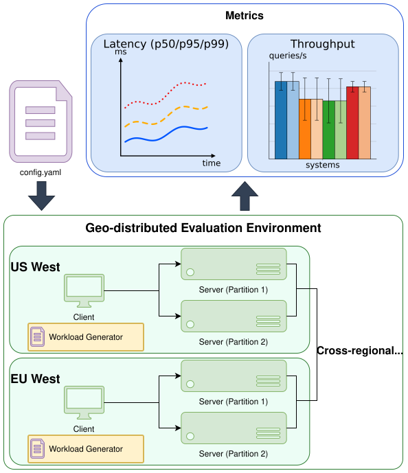
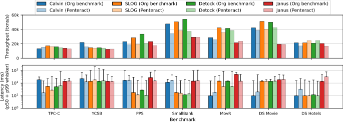
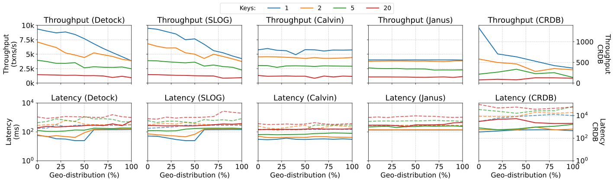

# Penteract

Penteract is a configurable OLTP workload generator for benchmarking geo-distributed databases. Built on top of the TPC-C schema Penteract introduces a wide range of knobs to control the transaction mix, the number of keys touched per transaction, the geo-distribution profile (i.e., percentage of local single-home, foreign single-home, and multi-home transactions), dependent transactions, data skew, and temporal dynamics.

Thanks to its configurability, Penteract can replicate several commonly used OLTP workload generators, including TPC-C, YCSB, PPS, SmallBank, MovR, DS Movie, and DS Hotels. Namely, with the right configuration, it can mimic the performance impact of each of them. Additionally, it reaches regions of the workload design space that none of them cover.

## High-Level Design

The user provides a single YAML configuration file describing the desired workload. The workload generator in each region picks up this configuration and feeds the corresponding transactions into the database servers of its region. During the run, Penteract collects performance metrics and reports them back to the user.

```yaml
{
    transaction_mix: "50:25:10:10:5",
    keys: "10:5:10000:2:1",
    mp_percent: "50:50:100:25:50",
    fsh_percent: "33:33:0:20:50",
    mh_percent: "33:0:20:0:50",
    dependent_percent: "50:50:0:0:0",
    skew: "0.5:0.0:0.9:0.0:0.999",
    temporal_dynamics: "10:90,50:50,90:10"
}
```
<p align="center"></p>

## Fidelity of Penteract

To test how accurately Penteract can model existing benchmarks, we examined the differences in throughput and latency on four state-of-the-art OLTP systems below.

<p align="center"></p>

## Example of Analysis

Since every dimension of Penteract is independently tunable, we can sweep entire regions of the workload space in a single experiment. For example, varying both the geo-distribution profile and the operation intensity reveals how the throughput and latency of Detock, SLOG, Calvin, Janus, and CockroachDB evolve across these dimensions.

<p align="center"></p>

## Running Penteract

To run Penteract, begin by compiling the system following [these instructions](https://github.com/delftdata/Penteract/blob/main/Build.md).

Then you can launch a cluster and run experiments following [these instructions](https://github.com/delftdata/Penteract/blob/main/tools/README.md).