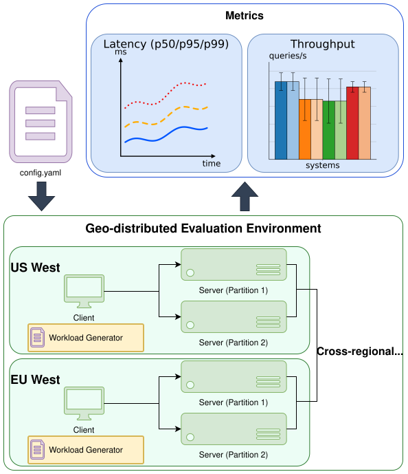
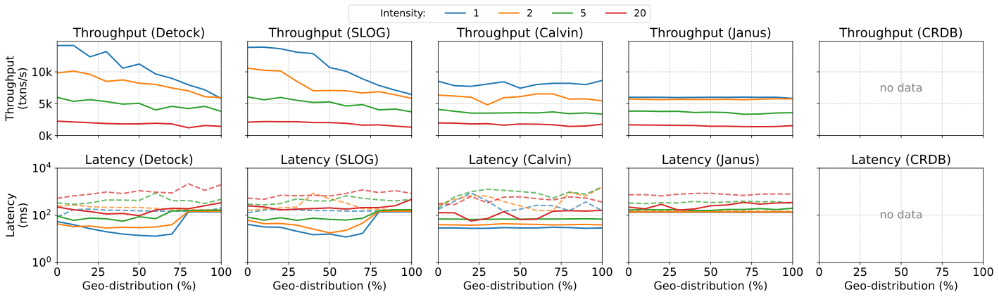

# BenchX

BenchX is a configurable OLTP workload generator for benchmarking geo-distributed databases. It is built on top of the TPC-C schema, and introduces a wide range of knobs to control the transaction mix, operation intensity, geo-distribution profile (i.e., percentage of multi-home, single-home, and foreign single-home), dependent transactions, data skew, and temporal dynamics.

Thanks to its configurability, BenchX covers a significant number of commonly used OLTP workload generators including TPC-C, YCSB+T, PPS, SmallBank, MovR, DS Movie, and DS Hotels. Namely, with the right configuration, it replicates the effect of each of them. In addition, it reaches regions of the workload design space that none of them cover.

## High-level Design

The user provides a single YAML configuration file describing the desired workload. The workload generator in each region picks up this configuration and feeds the corresponding transactions into the database servers of its region. During the run, BenchX collects performance metrics and reports them back to the user.

```yaml
{
    transaction_mix: "50:25:10:10:5",
    intensity: "10:5:10000:2:1",
    mp_percent: "50:50:100:25:50",
    fsh_percent: "33:33:0:20:50",
    mh_percent: "33:0:20:0:50",
    dependent_percent: "50:50:0:0:0",
    skew: "0.5:0.0:0.9:0.0:0.999",
    temporal_dynamics: "10:90,50:50,90:10"
}
```
<p align="center"></p>

## Example of Analysis

Because every dimension of BenchX is independently tunable, we can sweep entire regions of the workload space in a single experiment. For example, varying both the geo-distribution profile and the operation intensity reveals how the throughput and latency of Detock, SLOG, Calvin, Janus, and CockroachDB evolve across these dimensions.

<p align="center"></p>